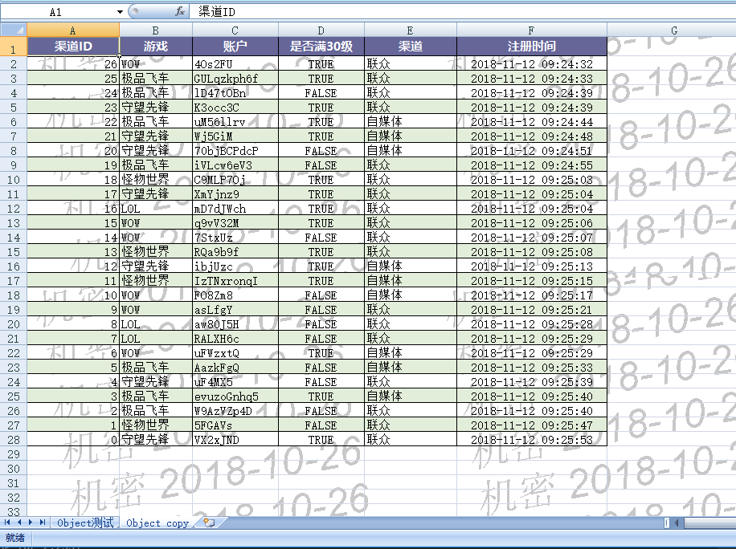
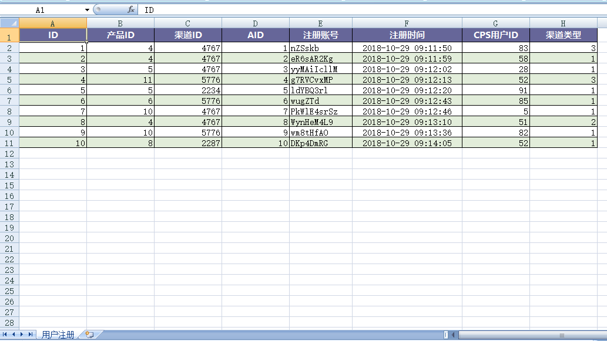
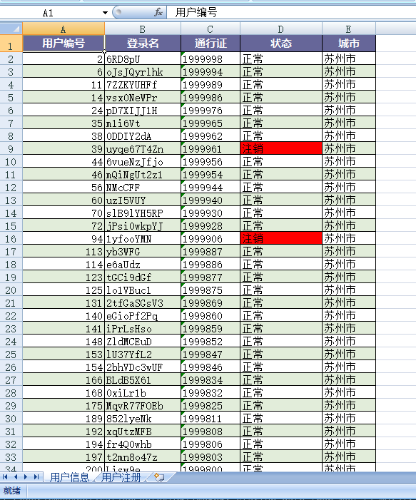

# EEC介绍

[![Build Status][travis-image]][travis] [![Release][release-image]][releases] [![License][license-image]][license]

EEC（Excel Export Core）是一个Excel读取和写入工具，目前支持xlsx格式的读取、写入以及xls格式的读取(xls支持版本BIFF8也就是excel 97~2003格式)。
EEC的设计初衷是为了解决Apache POI高内存且API臃肿的诟病，EEC的底层并没有使用Apache POI包，所有的底层读写代码均自己实现，事实上EEC仅依懒`dom4j`和`slf4j`，前者用于小文件xml读取，后者统一日志接口。

与传统Excel操作工具不同之处在于EEC并不缓存或只少量缓存数据到内存，写文件时EEC使用分片来处理较大的数据，使用迭代模式读取Excel行内容，当你使用某行数据的时才去解析它们，而不会将整个文件读入到内存。

从BIFF5以后Office就使用SharedString方式保存字符串，这样可以在多个Worksheet间达到共享字符串和压缩文件的目的。POI使用`inlineStr`方式写字符串，EEC默认也是使用inlineStr方式，你可以使用注解`@ExcelColumn(share = true)`来使用SharedString模式。

EEC最大特点是`高速`和`低内存`，如果在项目中做数据导入导出，选用EEC将为你带来极大的便利，同时它的`可扩展`能力也不弱。

使用`inlineStr`模式的情况下EEC的读写内存可以控制在*10MB*以下，`SharedString`模式也可以控制在*16MB*以下。[这里](https://www.ttzero.org/excel/2020/03/05/eec-vs-easyexcel-2.html)有关于EEC的压力测试，最低可以在*6MB*的情况下完成1000万行x29列数据的读写。

EEC采用单线程、高IO设计，多核心、高内存并不能显著提高速度，高主频和一块好SSD能显著提升速度。

EEC在JVM参数`-Xmx6m -Xms1m`下读写`1,000,000行x29列`内存使用截图

写文件


读文件


## 现状

目前已实现worksheet类型有

- [ListSheet](./src/main/java/org/ttzero/excel/entity/ListSheet.java) // 对象数组
- [ListMapSheet](./src/main/java/org/ttzero/excel/entity/ListMapSheet.java) // Map数组
- [StatementSheet](./src/main/java/org/ttzero/excel/entity/StatementSheet.java) // PreparedStatement
- [ResultSetSheet](./src/main/java/org/ttzero/excel/entity/ResultSetSheet.java) // ResultSet支持(多用于存储过程)
- [EmptySheet](./src/main/java/org/ttzero/excel/entity/EmptySheet.java) // 空worksheet

也可以继承已知[Worksheet](./src/main/java/org/ttzero/excel/entity/Sheet.java)来实现自定义数据源，比如微服务，mybatis或者其它RPC

EEC并不是一个功能全面的Excel操作工具类，它功能有限并不能用它来完全替代Apache POI，它最擅长的操作是表格处理。比如将数据库表导出为Excel或者读取Excel表格内容到Stream或数据库。

## 主要功能

1. 支持大数据量导出，行数无上限。如果数据量超过单个sheet上限会自动分页。（xlsx单sheet最大1,048,576行）
2. 支持 对象数组 和 Map数组 导出。
3. 可以为某列设置阀值高亮显示。如导出学生成绩时低于60分的单元格背景标黄显示。
4. int类型(byte,char,short,int)方便转可被识别文字
5. excel隔行变色，利于阅读
6. 设置列宽自动调节（功能未完善）
7. 设置水印（文字，本地＆网络图片）
8. 提供Watch窗口查看操作细节也可以做进度条。
9. ExcelReader采用stream方式读取文件，只有当你操作某行数据的时候才会执行读文件，而不会将整个文件读入到内存。
10. Reader支持iterator或者stream+lambda操作sheet或行数据，你可以像操作集合类一样读取并操作excel

## 使用方法

pom.xml添加

```
<dependency>
    <groupId>org.ttzero</groupId>
    <artifactId>eec</artifactId>
    <version>${eec.version}</version>
</dependency>
```

## xls格式支持

xls格式的读写目前处于开发中，项目地址[eec-e3-support](https://github.com/wangguanquan/eec-e3-support)暂时未开源，尝鲜的朋友可以在本项目的[beta](./beta)目录下找到相关jar包，加入到项目classpath即可实现xls格式读取，xls格式的读取与xlsx对外暴露完全一样。

示例请查找`testReadXLS()`方法。

## CSV格式支持

ExcelWriter支持csv格式，只需要在`writeTo`方法前添加`saveAsCSV()`即可。[测试代码参考](./src/test/java/org/ttzero/excel/entity/csv)

#### CSV与Excel格式互转

- CSV => Excel 向Workbook中添加一个`CSVSheet`即可
- Excel => CSV 读Excel后通过Worksheet调用`saveAsCSV`

代码示例

```
// CSV转Excel
new Workbook("csv path test", author)
    .addSheet(new CSVSheet(csvPath)) // 添加CSVSheet并指定csv路径
    .writeTo(getOutputTestPath());
    
// Excel转CSV
try (ExcelReader reader = ExcelReader.read(testResourceRoot().resolve("1.xlsx"))) {
    // 读取Excel并保存为CSV格式
    reader.sheet(0).saveAsCSV(getOutputTestPath());
} catch (IOException e) {
    e.printStackTrace();
}
```

## 示例

### 导出示例，更多使用方法请参考test/各测试类

所有测试生成的excel文件均放在target/excel目录下，可以使用`mvn clean`清空。测试命令可以使用`mvn clean test`
清空先前文件避免找不到测试结果文件

#### 1. 对象数组导出

#### 1.1 准备工作
对象数组导出时可以在对象上使用注解`@ExcelColumn("column name")`来设置excel头部信息，使用注解`@IgnoreExport`标记不需要导出的字段。

```
    @NotExport("敏感信息不导出")
    private int id; // not export

    @ExcelColumn("渠道ID")
    private int channelId;

    @ExcelColumn(share = false)
    private String account;

    @ExcelColumn("注册时间")
    private Timestamp registered;
```

默认情况下导出的列顺序与字段在对象中的定义顺序一致，也可以在`addSheet`时重置列头顺序。

```
public void testWrite(List<Student> students) throws IOException {
    // 创建一个名为"test object"的excel文件，指定作者，不指定时默认取系统登陆名
    new Workbook("test object", "guanquan.wang")
        // 添加一个worksheet，可以通过addSheet添加多个worksheet
        .addSheet(new ListSheet<>("学生信息", students))
        // 指定输出位置，如果做文件导出可以直接输出到`respone.getOutputStream()`
        .writeTo(Paths.get("f:/excel"));
}
```

#### 2. 高亮显示成绩低于60分的单元格

高亮和int转换是通过`@FunctionalInterface`实现，目前仅提供int值转换。

```
// 定义一个动态改变填充的lambda表达式，成绩低于60分标黄
private StyleProcessor sp = (o, style, sst) -> {
    if ((int)o < 60) {
        style = Styles.clearFill(style)
            | sst.addFill(new Fill(PatternType.solid, Color.orange));
    }
    return style;
};

// 定义一个int值转换lambda表达式，成绩低于60分显示"不及格"，其余显示正常分数
private IntConversionProcessor conversion = n -> n < 60 ? "不及格" : n;
```

```
public void testStyleConversion(List<Student> students) throws IOException {
    new Workbook("object style processor", "guanquan.wang")
        .addSheet(new ListSheet<>("期末成绩", students
            , new Sheet.Column("学号", "id", int.class)
            , new Sheet.Column("姓名", "name", String.class)
            , new Sheet.Column("成绩", "score", int.class, conversion)
                .setStyleProcessor(sp)
            )
        )
        .writeTo(Paths.get("f:/excel"));
}
```

内容如下图



#### 3. 自定义数据源

有时候数据并不来自于一个数据库或一个服务器，也不能一次将数据取到数组中，此时可以自定义一个worksheet继承已有的Sheet类并覆写`more`方法即可。如下

```
public class CustomizeDataSourceSheet extends ListSheet<Student> {

    // RPC, mybatis, jpa or others service
    private StudentService service;
    // The paging info
    private int pageNo, limit = 100;
    // The query parameter
    private Parameter params;

    /**
     * 指定worksheet名称
     */
    public CustomizeDataSourceSheet(String name, Parameter params) {
        super(name);
        this.service = new StudentService();
        this.params = params;
    }

    /**
     * 获取worksheet行数据，返回null或空数组表示当前worksheet写结束
     */
    @Override
    public List<Student> more() {
        return service.getPageData(params, pageNo++, limit);
    }
}

/**
 * 测试类
 */
public void testCustomizeDataSource(Parameter params) throws IOException {
    new Workbook("customize datasource")
        // 设置自定义数据源worksheet
        .addSheet(new CustomizeDataSourceSheet("自定义源", params))
        .writeTo(Paths.get("f:/excel"));
}

// 也可以简化为
new Workbook("customize datasource")
    .addSheet(new ListSheet<Student>("自定义源") {
        private int pageNo, limit = 100;
        @Override
        public List<Student> more() {
            return service.getPageData(pageNo++, limit);
        }
    })
    .writeTo(Paths.get("f:/excel"));
```
更详细的信息请查测试类[CustomizeDataSourceSheet](./src/test/java/org/ttzero/excel/entity/CustomizeDataSourceSheet.java)

#### 4. 数据源为关系型数据库

数据源为关系型数据库时可以使用`StatementSheet`和`ResultSetSheet`两种Worksheet，它们的工作方式是将SQL和参数交给EEC，EEC内部去查询并使用游标做到取一个值写一个值，省掉了将表数据转为Java实体的过程。

```
public void testFromDatabase() {
    try (Connection con = dataSource.getConnection()) {
        new Workbook("用户注册列表", author) // 指定workbook名，作者
            .setConnection(con) // 数据库连接
            .setAutoSize(true) // 列宽自动调节
            .watch(System.out::println) // 添加watch窗口查看导出细节
            .addSheet("用户注册"
                , "select id,pro_id,channel_no,aid,account,regist_time,uid,platform_type from wh_regist limit 10"
                , new Sheet.Column("ID", int.class)
                , new Sheet.Column("产品ID", int.class)
                , new Sheet.Column("渠道ID", int.class)
                , new Sheet.Column("AID", int.class)
                // 默认字符串多个worksheet共享，如果已知字符串唯一可设置为不共享
                , new Sheet.Column("注册账号", String.class, false)
                , new Sheet.Column("注册时间", Timestamp.class)
                , new Sheet.Column("CPS用户ID", int.class)
                , new Sheet.Column("渠道类型", int.class)
            ) // 添加一个sheet页
            .writeTo(Paths.get("f:\\excel"));
    } catch (SQLException | IOException e) {
        e.printStackTrace();
    }
}
```

执行以上代码会在`f:\\excel`文件夹下生成一个《用户注册列表.xlsx》文件

内容如下图



#### 5. SQL带参数测试，且将满足条件的单元格标红。

```
public void testFromDatabase2() {
    try (Connection con = dataSource.getConnection()) {
        String[] cs = {"正常", "注销"};
        final Fill fill = new Fill(PatternType.solid, Color.red);
        new Workbook("多Sheet页-值转换＆样式转换", creator)
            .setConnection(con)
            .setAutoSize(true)
            .addSheet("用户信息"
                , "select id,name,account,status,city from t_user where id between ? and ? and city = ?"
                , p -> {
                    p.setInt(1, 1);
                    p.setInt(2, 500);
                    p.setString(3, "苏州市");
                } // 设定SQL参数
                , new Sheet.Column("用户编号", int.class)
                , new Sheet.Column("登录名", String.class, false) // 登录名都是唯一的设置不共享
                , new Sheet.Column("通行证", String.class)
                , new Sheet.Column("状态", char.class, c -> cs[c]) // 将0/1用户无感的数字转为文字
                    .setStyleProcessor((n, style, sst) -> {
                        if ((int) n == 1) { // 将注销的用户标记
                            style = Styles.clearFill(style) | sst.addFill(fill); // 注销标红
                        }
                        return style;
                    })
                , new Sheet.Column("城市", String.class)
            )
            .writeTo(Paths.get("f:\\excel"));
    } catch (SQLException | IOException e) {
        e.printStackTrace();
    }
}
```

Excel如下图



#### 6. 模板方式

有时候你可能会使用模板来规范格式，不固定的部分使用${key}标记，Excel导出时使用Map或者Java bean传入。

如有以下格式模板文件template.xlsx

>                       通知书
>     ${name } 同学，在本次期末考试的成绩是 ${score}。
>                                 ${date }

测试代码

```
@Test public void t4() {
    try (FileInputStream fis = new FileInputStream(new File(defaultPath.toString(), "template.xlsx"))) {
        // Map data
        Map<String, Object> map = new HashMap<>();
        map.put("name", "guanquan.wang");
        map.put("score", 90);
        map.put("date", "2018-02-12 12:22:29");

        // java bean
//        BindEntity entity = new BindEntity();
//        entity.score = 67;
//        entity.name = "张三";
//        entity.date = new Timestamp(System.currentTimeMillis());

        new Workbook("模板导出", creator)
            .withTemplate(fis, map) // 绑定模板
            .writeTo(Paths.get("f:\\excel")); // 写到某个文件夹
    } catch (IOException e) {
        e.printStackTrace();
    }
}
```

### 读取示例

Excel使用`ExcelReader#read`静态方法读文件，其内部采用流式操作，当使用某一行数据时才会真正读入内存，所以即使是GB级别的Excel文件也只占用少量内存。

默认的ExcelReader仅读取单元格的值而忽略单元格的公式，可以使用`ExcelReader#parseFormula`方法使Reader解析单元格的公式。

下面展示一些常规的读取方法

#### 1. 使用iterator迭代每行数据

```
/**
 * 使用iterator遍历所有行
 */
public void iteratorRead() {
    try (ExcelReader reader = ExcelReader.read(defaultPath.resolve("单Sheet.xlsx"))) {
        // Get first sheet
        Sheet sheet = reader.sheet(0);

        for (
            Iterator<Row> ite = sheet.iterator();
            ite.hasNext();
            System.out.println(ite.next())
        );
    } catch (IOException e) {
        e.printStackTrace();
    }
}
```

#### 2. 使用stream操作

```
public void streamRead() {
    try (ExcelReader reader = ExcelReader.read(defaultPath.resolve("用户注册.xlsx"))) {
        reader.sheets().flatMap(Sheet::rows).forEach(System.out::println);
    } catch (IOException e) {
        e.printStackTrace();
    }
}
```

#### 3. 将excel读入到数组或List中

```
/**
 * read excel to object array
 */
public void readToList() {
    try (ExcelReader reader = ExcelReader.read(defaultPath.resolve("用户注册.xlsx"))) {
        Regist[] array = reader.sheets() // 所有worksheet
            .flatMap(Sheet::dataRows) // 去掉表头和空行
            .map(row -> row.to(Regist.class)) // 将每行数据转换为Regist对象
            .toArray(Regist[]::new);
        // do...
    } catch (IOException e) {
        e.printStackTrace();
    }
}
```

#### 4. 当然既然是Stream那么就可以使用流的全部功能，比如加一些过滤和聚合等。

```
reader.sheets()
    .flatMap(Sheet::dataRows)
    .map(row -> row.to(Regist.class))
    .filter(e -> "iOS".equals(e.platform()))
    .collect(Collectors.toList());
```

以上代码相当于`select * from 用户注册 where platform = 'iOS'`


#### 4.1 根据列名过滤列

```
@Test public void testFilter() {
    try (ExcelReader reader = ExcelReader.read(testResourceRoot().resolve("1.xlsx"))) {
        String[] games = reader.sheet(0)
            .dataRows()
            .map(row -> row.getString("游戏"))
            .distinct()
            .toArray(String[]::new);
        print(Arrays.toString(games));
    } catch (IOException e) {
        e.printStackTrace();
    }
}
```

以上方法获取excel文件的"游戏"列的不重复值

#### 5. xls读取
xls读取对方法式与xlsx完全一致

```
public void testReadXLS() {
    try (ExcelReader reader = ExcelReader.read(defaultPath.resolve("用户注册.xls"))) {
        reader.sheets().flatMap(Sheet::rows).forEach(System.out::println);
    } catch (IOException e) {
        e.printStackTrace();
    }
}
```

#### 6. 读取单元格公式

```
@Test public void testFormula() {
    try (ExcelReader reader = ExcelReader.read(testResourceRoot().resolve("formula.xlsx"))) {
        if (reader.hasFormula()) {
        
            // Call `parseFormula` to parse formula
            reader.parseFormula().sheets().flatMap(sheet -> {
                println("----------------" + sheet.getName() + "----------------");
                return sheet.dataRows();
            }).forEach(row -> {
                for (int i = row.fc; i < row.lc; i++) {
                    if (row.hasFormula(i)) {
                        print(int2Col(i + 1));
                        print(row.getRowNumber());
                        print("=");
                        print(row.getFormula(i)); // Getting formula string
                        println();
                    }
                }
            });
        }
    } catch (IOException e) {
        e.printStackTrace();
    }
}
```

## CHANGELOG
Version 0.4.2 (2020-03-04)
-------------
1. 修复读poi生成的excel文件内容转对象时值为空的异常
2. 修复读取某些空worksheet时抛IllegalArgumentException异常
3. 使用slf4j统一日志接口，不强制用户使用log4j
4. 字符串值默认使用inlineStr方式而非SharedString里从而提升一些写入速度
5. 调整压缩等级提升一些压缩速度，最终文件比以前有所增加

Version 0.4.1 (2020-03-03)
-------------
1. 修复ListObject导出文件时数据比实际数据少的BUG
2. 修复ExcelColumn注解只有`share`属性时share值无效的BUG

Version 0.4.0 (2020-02-24)
-------------
1. Worksheet增加`getDimension`方法返回单元格范围，替换原`getSize`方法
2. 支持获取单元格公式
3. 修复SNAPSHOT版导出excel文件无法正常打开的错误
4. ExcelReader增加打开模式，可以指定读取单元格公式或者`合并单元格`的值。

[更多...](./CHANGELOG)

[travis]: https://travis-ci.org/wangguanquan/eec
[travis-image]: https://travis-ci.org/wangguanquan/eec.png?branch=master

[releases]: https://github.com/wangguanquan/eec/releases
[release-image]: http://img.shields.io/badge/release-0.4.2-blue.svg?style=flat

[license]: http://www.apache.org/licenses/LICENSE-2.0
[license-image]: http://img.shields.io/badge/license-Apache--2-blue.svg?style=flat
