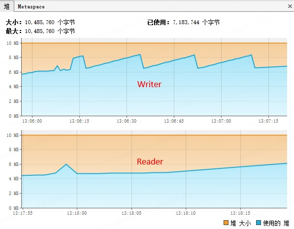
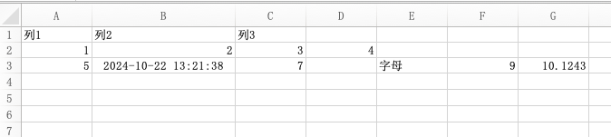
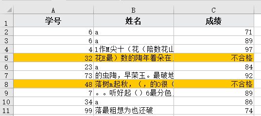
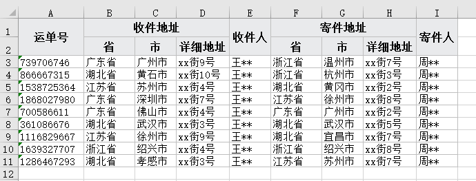

# EEC介绍

[![Release][release-image]][releases] [![License][license-image]][license]

EEC（Excel Export Core）是一款轻量且高效的Excel读写工具，它具有包体小、接入代码量少和运行时消耗资源少等优点

EEC的设计初衷是为了解决Apache POI内存高、速度慢且API臃肿的诟病。EEC的底层并不依赖POI包，所有的底层代码均自己实现，事实上EEC仅依赖`dom4j`和`slf4j`，前者用于小文件xml读取，后者统一日志接口。

EEC在JVM参数`-Xmx10m -Xms10m`下读写100w行x29列内存使用截图，下载 [eec-benchmark](https://github.com/wangguanquan/eec-benchmark) 项目进行性能测试



## 使用场景

EEC是*线程不安全*的它不支持多线程读写，同时其为流式设计且只能顺序向后，这意味着不能通过指定行列坐标来随机读写，通常可以使用EEC来做一些日常的导入/导出功能，推荐在**大数据量**或**性能/内存要求**较高的场景或者没有随机读写的场景下使用。

目前已实现worksheet类型有以下七种，也可以继承已有[Worksheet](./src/main/java/org/ttzero/excel/entity/Sheet.java)来实现自定义数据源

- [ListSheet](./src/main/java/org/ttzero/excel/entity/ListSheet.java) // 对象数组
- [ListMapSheet](./src/main/java/org/ttzero/excel/entity/ListMapSheet.java) // Map数组
- [TemplateSheet](./src/main/java/org/ttzero/excel/entity/TemplateSheet.java) // 模板工作表
- [StatementSheet](./src/main/java/org/ttzero/excel/entity/StatementSheet.java) // PreparedStatement
- [ResultSetSheet](./src/main/java/org/ttzero/excel/entity/ResultSetSheet.java) // ResultSet支持(多用于存储过程)
- [CSVSheet](./src/main/java/org/ttzero/excel/entity/CSVSheet.java) // 支持csv与xlsx互转
- [EmptySheet](./src/main/java/org/ttzero/excel/entity/EmptySheet.java) // 空worksheet
- [SimpleSheet](./src/main/java/org/ttzero/excel/entity/SimpleSheet.java) // 简单工作表

## 主要功能

1. 支持**大数据量导出**行数无上限，超过单个Sheet上限会自动分页
2. **超低内存**，无论是xlsx还是xls格式，大部分情况下可以在10MB以内完成十万级甚至百万级行数据读写
3. 支持动态样式，如导出库存时将低于预警阈值的行背景标黄显示
4. 支持一键设置斑马线，利于阅读
5. **自适应列宽对中文更精准**
6. 采用Stream流读文件，按需加载不会将整个文件读入到内存
7. 支持Iterator和Stream+Lambda读文件，你可以像操作集合类一样操作Excel
8. 支持csv与excel格式相互转换

## WIKI

阅读[WIKI](https://github.com/wangguanquan/eec/wiki) 了解更多用法

## Gitee

国内用户可访问[Gitee](https://gitee.com/wangguanquan/eec)， 在Gitee提issue开发者也同样会及时回复

## 使用方法

pom.xml添加

```xml
<dependency>
    <groupId>org.ttzero</groupId>
    <artifactId>eec</artifactId>
    <version>${eec.version}</version>
</dependency>
```

## 示例

#### 1. 简单导出
使用SimpleSheet简单工作表导出Excel可以不必定义对象或者Map，直接添加单元格的值即可导出。

```java
// 准备导出数据
List<Object> rows = new ArrayList<>();
rows.add(new String[] {"列1", "列2", "列3"});
rows.add(new int[] {1, 2, 3, 4});
rows.add(new Object[] {5, new Date(), 7, null, "字母", 9, 10.1243});

new Workbook()
    .addSheet(new SimpleSheet<>(rows)) // 添加一个简单工作表
    .writeTo(Paths.get("f:/excel")); // 导出到F:/excel目录下
```



#### 2. 对象导出
对象数组是使用最广泛的工作表，导出时需要在对象的属性上添加注解`@ExcelColumn("列名")`来标识当前属性可被导出，默认情况下导出的列顺序与字段在对象中的定义顺序一致，可以通过指定`colIndex`来重置列顺序。

```java
// 定义导出对象
public class Student {
    @ExcelColumn("学号")
    private int id;

    @ExcelColumn("姓名")
    private String name;
}

// 创建一个名为"一年级学生表"的excel文件
new Workbook("一年级学生表")

    // 添加"工作表"并指定导出数据，可以通过addSheet添加多个worksheet
    .addSheet(new ListSheet<>("学生信息", students))

    // 指定输出位置，如果做文件导出可以直接输出到`respone.getOutputStream()`
    .writeTo(Paths.get("f:/excel"));
```

#### 3. 动态样式

动态样式和数据转换都是使用`@FunctionalInterface`实现，通常用于**突出或高亮**显示一些重要的单元格或行，下面展示如何将低下60分的成绩输出为"不合格"并将整行标为橙色

```java
new Workbook("2021小五班期未考试成绩")
    .addSheet(new ListSheet<>("期末成绩", students
         , new Column("学号", "id", int.class)
         , new Column("姓名", "name", String.class)
         , new Column("成绩", "score", int.class, n -> (int) n < 60 ? "不合格" : n)
    ).setStyleProcessor((o, style, sst) -> 
            o.getScore() < 60 ? sst.modifyFill(style, new Fill(PatternType.solid, Color.orange)) : style)
    ).writeTo(Paths.get("f:/excel"));
```



#### 4. 支持模板导出

TemplateSheet工作表支持xls和xlsx模板格式，使用模板工作表可以**合并多个Excel文件**也可以和其它工作表混用，关于模板工作表请参考[3-模板导出](https://github.com/wangguanquan/eec/wiki/3-%E6%A8%A1%E6%9D%BF%E5%AF%BC%E5%87%BA)

```java
new Workbook()
    
    // 复制[企业名片.xls]文件的[封面]工作表
    .addSheet(new TemplateSheet(Paths.get("./template/企业名片.xls", "封面"))
    
    // 复制[商品导入模板]的第一个工作表，并添加导出数据
    .addSheet(new TemplateSheet(Paths.get("./template/商品导入模板.xlsx"))
        .setData(Entity.mock()) // 设置对象 对应占位符${*}
        // 分片拉取数据 对应占位符${list.*}
        .setData("list", (i,lastOne) -> scrollQuery(i > 0 ? ((Product)lastOne).getId() : 0))
    ).writeTo(Paths.get("f:/excel"));
```

#### 5. 自适应列宽更精准

```java
// 测试类
public static class WidthTestItem {
    @ExcelColumn(value = "整型", format = "#,##0_);[Red]-#,##0_);0_)")
    private Integer nv;
    @ExcelColumn("字符串(en)")
    private String sen;
    @ExcelColumn("字符串(中文)")
    private String scn;
    @ExcelColumn(value = "日期时间", format = "yyyy-mm-dd hh:mm:ss")
    private Timestamp iv;
}

new Workbook("Auto Width Test")
    .setAutoSize(true) // <- 自适应列宽
    .addSheet(new ListSheet<>(randomTestData()))
    .writeTo(Paths.get("f:/excel"));
```


#### 6. 支持多级表头

EEC使用多个ExcelColumn注解来实现多级表头，名称一样的行或列将自动合并

```java
 public static class RepeatableEntry {
    @ExcelColumn("运单号")
    private String orderNo;
    @ExcelColumn("收件地址")
    @ExcelColumn("省")
    private String rProvince;
    @ExcelColumn("收件地址")
    @ExcelColumn("市")
    private String rCity;
    @ExcelColumn("收件地址")
    @ExcelColumn("详细地址")
    private String rDetail;
    @ExcelColumn("收件人")
    private String recipient;
    @ExcelColumn("寄件地址")
    @ExcelColumn("省")
    private String sProvince;
    @ExcelColumn("寄件地址")
    @ExcelColumn("市")
    private String sCity;
    @ExcelColumn("寄件地址")
    @ExcelColumn("详细地址")
    private String sDetail;
    @ExcelColumn("寄件人")
    private String sender;
}
```


#### 7. 报表轻松制作

现在使用普通的ListSheet就可以导出漂亮的报表。示例请跳转到 [WIKI](https://github.com/wangguanquan/eec/wiki/%E6%8A%A5%E8%A1%A8%E7%B1%BB%E5%AF%BC%E5%87%BA%E6%A0%B7%E5%BC%8F%E7%A4%BA%E4%BE%8B)


#### 8. 支持28种预设图片样式

导出图片时添加内置样式使其更美观，关于图片样式请参考[1-导出Excel#导出图片](https://github.com/wangguanquan/eec/wiki/1-%E5%AF%BC%E5%87%BAExcel#%E5%AF%BC%E5%87%BA%E5%9B%BE%E7%89%87)


### 读取示例

EEC使用`ExcelReader#read`静态方法读文件，其支持标准Stream所以可以直接使用`map`、`filter`和`collect`等JDK内置函数，读取Excel就像操作集合类一样简单，极大降低学习成本。

#### 1. 使用Stream

```java
try (ExcelReader reader = ExcelReader.read(Paths.get("./User.xlsx"))) {
    // 读取所有worksheet并输出
    reader.sheets().flatMap(Sheet::rows).forEach(System.out::println);
} catch (IOException e) {
    e.printStackTrace();
}
```

#### 2. 读入到数组或List中

```java
try (ExcelReader reader = ExcelReader.read(Paths.get("./User.xlsx"))) {
    List<User> users = reader.sheet(0) // 读取第1个Sheet页
        .header(6)                     // 指定第6行为表头
        .rows()                        // 读取数据行
        .map(row -> row.to(User.class))// 将每行数据转换为User对象
        .collect(Collectors.toList()); // 收集数据进行后续处理
} catch (IOException e) {
    e.printStackTrace();
}
```

#### 3. 过滤和聚合

EEC支持Stream的大部分功能，以下代码使用`filter`来演示如何过滤平台为"iOS"的注册用户

```java
reader.sheet(0).header(6)
    .rows()
    // 过滤平台为"iOS"的用户
    .filter(row -> "iOS".equals(row.getString("platform")))
    .map(row -> row.to(User.class))
    .collect(Collectors.toList());
```

#### 4. 多级表头读取

多级表头可以使用`header`方法来指定表头所在的多个行号，多级表头将使用`:`拼接多个行单元格来组成一个聚合头

```java
reader.sheet(0)
    .header(1, 2)    // <- 指定第1、2行均为表头
    .rows()
    .map(Row::toMap) // <- Row 转 Map
    .forEach(System.out::println);

# 输出如下（数据均随机生成所以输出与示例不一致）
运单号 | 收件地址:省 | 收件地址:市 | 收件地址:详细地址 | 收件人 | 寄件地址:省 | 寄件地址:市 | 寄件地址:详细地址 | 寄件人
921674764 | 湖北省 | 宜昌市 | xx街4号 | 王** | 江苏省 | 南京市 | xx街5号 | 周**
1512518776 | 广东省 | 佛山市 | xx街6号 | 王** | 广东省 | 广州市 | xx街7号 | 周**
1473338301 | 浙江省 | 杭州市 | xx街4号 | 王** | 湖北省 | 黄冈市 | xx街7号 | 周**
1484573956 | 湖北省 | 武汉市 | xx街4号 | 王** | 江苏省 | 南京市 | xx街9号 | 周**
1409795643 | 湖北省 | 黄冈市 | xx街3号 | 王** | 江苏省 | 南京市 | xx街1号 | 周**
```

多级表头将以`A1:A2:A3`这种格式进行纵向拼接，读取第6个示例中的运单数据读取结果将以`运单号`，`收件地址:省`，`收件地址:市`呈现，这样就可以解决出现两个`省`、`市`导致错乱的问题

更多关于多表头使用方法可以参考 [WIKI](https://github.com/wangguanquan/eec/wiki/%E5%A6%82%E4%BD%95%E8%AE%BE%E7%BD%AE%E5%A4%9A%E8%A1%8C%E8%A1%A8%E5%A4%B4#%E8%AF%BB%E5%8F%96%E5%B8%A6%E5%A4%9A%E8%A1%8C%E8%A1%A8%E5%A4%B4%E7%9A%84%E6%96%87%E4%BB%B6)

### xls格式支持

pom.xml添加如下依赖，添加好后即完成了xls的兼容，是的！你不需要为xls格式添加任何一行代码。

```xml
<dependency>
    <groupId>org.ttzero</groupId>
    <artifactId>eec-e3-support</artifactId>
    <version>${eec-e3-support.version}</version>
</dependency>
```

读取xls的方法与xlsx完全一样，外部不需要判断是哪种格式，EEC为其提供了完全一样的接口，内部会根据文件头去判断具体类型，这种方式比简单判断文件后缀准确得多。

两个工具的兼容性 [参考此表](https://github.com/wangguanquan/eec/wiki/EEC%E4%B8%8EE3-support%E5%85%BC%E5%AE%B9%E6%80%A7%E5%AF%B9%E7%85%A7%E8%A1%A8)

### CSV与Excel格式互转

- CSV => Excel：向Workbook中添加一个`CSVSheet`工作表
- Excel => CSV：读Excel时调用`saveAsCSV`另存为csv格式

代码示例

```java
// 直接保存为csv生成测试文件，对于数据量较多的场合也可以使用#more方法分批获取数据
new Workbook()
    .addSheet(createTestData())
    .saveAsCSV() // 指定输出格式为csv
    .writeTo(Paths.get("d:\\abc.csv"));

// CSV转Excel
new Workbook()
    .addSheet(new CSVSheet(Paths.get("d:\\abc.csv"))) // 添加CSVSheet并指定csv路径
    .writeTo(Paths.get("d:\\abc.xlsx"));
    
// Excel转CSV
try (ExcelReader reader = ExcelReader.read(Paths.get("d:\\abc.xlsx"))) {
    // 读取Excel使用saveAsCSV保存为CSV格式
    reader.sheet(0).saveAsCSV(Paths.get("./"));
} catch (IOException e) {
    e.printStackTrace();
}
```

## CHANGELOG
Version 0.5.23 (2025-05-06)
-------------
- 修复读取图片时某些特殊设置造成读取异常
- 修复某些情况下读取共享字符串异常
- 修复指定自定义表头且指定headerRow为1时不跳过表头行的问题
- 修复Dimension#toReferer方法计算结束坐标错误
- 模板工作表新增useOriginalSheetName方法使导出的文件保持源Sheet名
- Dimension#of方法新增特性，冒号后面无坐标时表示列尾

Version 0.5.22 (2025-02-23)
-------------
- 开放性能模式提升导出速度
- 支持读取批注，xls暂不支持(#418)
- 支持跨工作表引用Validation(#420)
- 优化读取图片，过滤隐藏、重复节点(#414)
- 模板工作表增加默认日期格式化

Version 0.5.21 (2024-12-24)
-------------
- 提升Excel转CSV时对时间类型的兼容性(#409)
- Excel转CSV时保持Excel中的空行位置
- 提升添加批注的便利性并开放批注的字体属性
- 模板导出支持File和Buffer图片类型
- 修复CSVSheet默认分割符设置为0x0的过失问题
- 修复导出批注数量超过57344时抛异常的BUG(#404)
- Converter方法增强，入参由String改为Row和Cell方便扩展

Version 0.5.20 (2024-11-13)
-------------
- 新增SimpleSheet简单工作表，简化导出的数据格式
- CSVSheetWriter新增分隔符delimiter属性
- 提升OpenJDK8-21的兼容性

[更多...](./CHANGELOG)

[releases]: https://github.com/wangguanquan/eec/releases
[release-image]: http://img.shields.io/badge/release-0.5.23-blue.svg?style=flat

[license]: http://www.apache.org/licenses/LICENSE-2.0
[license-image]: http://img.shields.io/badge/license-Apache--2-blue.svg?style=flat
