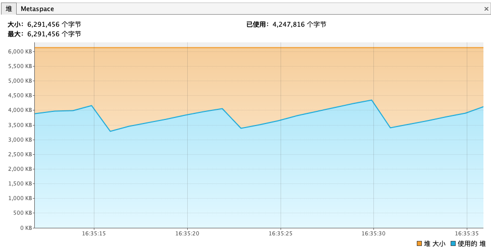
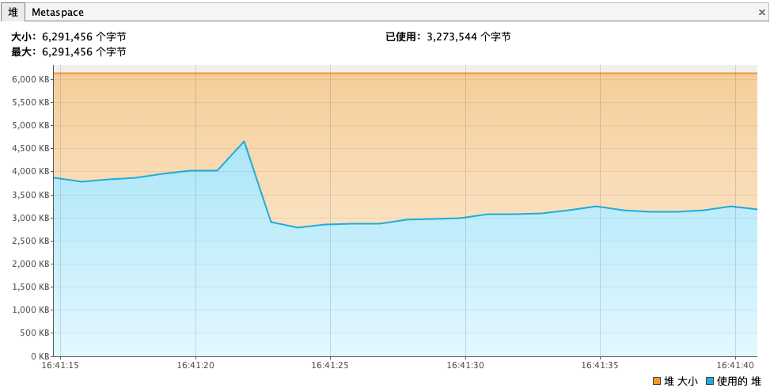
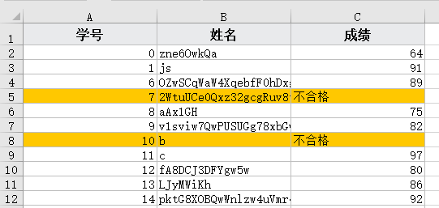
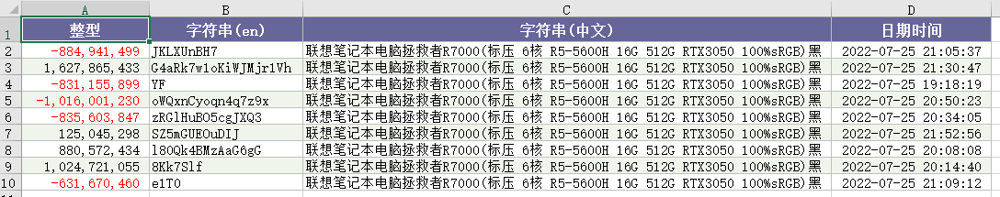
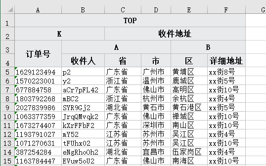
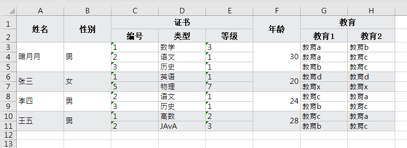
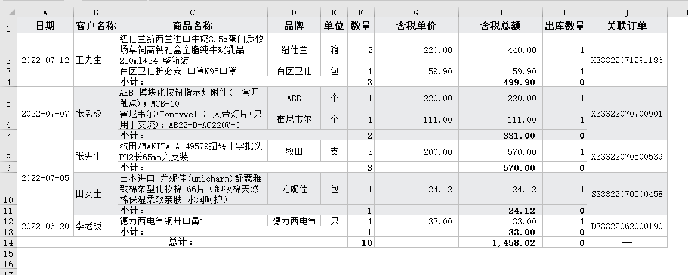

# EEC介绍

[![Build Status][travis-image]][travis] [![Release][release-image]][releases] [![License][license-image]][license]

EEC（Excel Export Core）是一个Excel读取和写入工具，目前支持xlsx格式的读取/写入以及xls格式的读取(xls支持版本BIFF8也就是excel 97~2003格式)。
EEC的设计初衷是为了解决Apache POI速度慢，高内存且API臃肿的诟病，EEC的底层并没有使用Apache POI包，所有的底层读写代码均自己实现，事实上EEC仅依懒`dom4j`和`slf4j`，前者用于小文件xml读取，后者统一日志接口。

EEC最大特点是`高性能`和`低内存`，如果在项目中做数据导入导出功能，选用EEC将为你带来极大的便利，同时它的`可扩展`能力也不弱。

使用`inlineStr`模式的情况下EEC的读写内存可以控制在*10MB*以下，`SharedString`模式也可以控制在*16MB*以下。[这里](https://www.ttzero.org/excel/2020/03/05/eec-vs-easyexcel-2.html) 有关于EEC的压力测试，最低可以在*6MB*的情况下完成100w行x29列数据的读写。

EEC采用单线程、高IO设计，所以多核心、高内存并不能显著提高速度，高主频和一块好SSD能显著提升速度。

EEC在JVM参数`-Xmx6m -Xms1m`下读写`100w行x29列`内存使用截图

写文件



读文件



## 现状

目前已实现worksheet类型有

- [ListSheet](./src/main/java/org/ttzero/excel/entity/ListSheet.java) // 对象数组
- [ListMapSheet](./src/main/java/org/ttzero/excel/entity/ListMapSheet.java) // Map数组
- [StatementSheet](./src/main/java/org/ttzero/excel/entity/StatementSheet.java) // PreparedStatement
- [ResultSetSheet](./src/main/java/org/ttzero/excel/entity/ResultSetSheet.java) // ResultSet支持(多用于存储过程)
- [EmptySheet](./src/main/java/org/ttzero/excel/entity/EmptySheet.java) // 空worksheet
- [CSVSheet](./src/main/java/org/ttzero/excel/entity/CSVSheet.java) // 支持csv与xlsx互转

也可以继承已知[Worksheet](./src/main/java/org/ttzero/excel/entity/Sheet.java)来实现自定义数据源，比如微服务，mybatis或者其它RPC

EEC并不是一个功能全面的Excel操作工具类，它功能有限并不能用它来完全替代Apache POI，它最擅长的操作是表格处理。比如将数据库表导出为Excel或者读取Excel表格内容到Stream或数据库。

## WIKI

阅读[WIKI](https://github.com/wangguanquan/eec/wiki) 了解更多用法


## 主要功能

1. 支持**大数据量导出**，行数无上限。如果数据量超过单个sheet上限会自动分页。（xlsx单sheet最大1,048,576行）
2. **超低内存**，无论是xlsx还是xls格式，大部分情况下可以在10MB以内完成十万级甚至百万级行数据读写。
3. 可以为某列设置阀值高亮显示，如导出学生成绩时低于60分的单元格背景标黄显示。
4. 支持一键设置斑马线，利于阅读
5. **自适应列宽对中文更精准**
6. 提供Watch窗口查看操作细节也可以做进度条。
7. ExcelReader采用stream方式读取文件，只有当你操作某行数据的时候才会执行读文件，而不会将整个文件读入到内存。
8. Reader支持iterator或者stream+lambda操作sheet或行数据，你可以像操作集合类一样读取并操作excel

## 使用方法

pom.xml添加

```xml
<dependency>
    <groupId>org.ttzero</groupId>
    <artifactId>eec</artifactId>
    <version>${eec.version}</version>
</dependency>
```

## 示例

### 导出示例，更多使用方法请参考test/各测试类

所有测试生成的excel文件均放在target/excel目录下，可以使用`mvn clean`清空。测试命令可以使用`mvn clean test`
清空先前文件避免找不到测试结果文件

#### 1. 简单导出
对象数组导出时可以在对象上使用注解`@ExcelColumn("column name")`来设置excel头部信息，未添加ExcelColumn注解标记的属性将不会被导出，也可以通过调用`forceExport`方法来强制导出。

```java
private int id; // not export

@ExcelColumn("渠道ID")
private int channelId;

@ExcelColumn
private String account;

@ExcelColumn("注册时间")
private Timestamp registered;
```

默认情况下导出的列顺序与字段在对象中的定义顺序一致，也可以设置`colIndex`或者在`addSheet`时重置列头顺序。

```java
// 创建一个名为"test object"的excel文件，指定作者，不指定时默认取系统登陆名
new Workbook("test object", "guanquan.wang")

    // 添加一个worksheet，可以通过addSheet添加多个worksheet
    .addSheet(new ListSheet<>("学生信息", students))

    // 指定输出位置，如果做文件导出可以直接输出到`respone.getOutputStream()`
    .writeTo(Paths.get("f:/excel"));
```

#### 2. 高亮和数据转换

高亮和数据转换是通过`@FunctionalInterface`实现，Java Bean也可以使用`StyleDesign`注解，下面展示如何将低下60分的成绩输出为"不合格"并将整行标红

```java
new Workbook("2021小五班期未考试成绩")
    .addSheet(new ListSheet<>("期末成绩", students
         , new Column("学号", "id", int.class)
         , new Column("姓名", "name", String.class)
         , new Column("成绩", "score", int.class, n -> (int) n < 60 ? "不合格" : n)
    ).setStyleProcessor((o, style, sst) -> 
            o.getScore() < 60 ? Styles.clearFill(style) | sst.addFill(new Fill(PatternType.solid, Color.orange)) : style)
    ).writeTo(Paths.get("f:/excel"));
```

内容如下图



#### 3. 自适应列宽更精准

```java
// 测试类
public static class WidthTestItem {
    @ExcelColumn(value = "整型", format = "#,##0_);[Red]-#,##0_);0_)")
    private Integer nv;
    @ExcelColumn("字符串(en)")
    private String sen;
    @ExcelColumn("字符串(中文)")
    private String scn;
    @ExcelColumn(value = "日期时间", format = "yyyy-mm-dd hh:mm:ss")
    private Timestamp iv;
}

new Workbook("Auto Width Test")
    .setAutoSize(true) // 自动列宽
    .addSheet(new ListSheet<>(randomTestData()))
    .writeTo(Paths.get("f:/excel"));
```


#### 4. 支持多行表头

```java
 public static class RepeatableEntry {
    @ExcelColumn("TOP")
    @ExcelColumn("K")
    @ExcelColumn
    @ExcelColumn("订单号")
    private String orderNo;
    @ExcelColumn("TOP")
    @ExcelColumn("K")
    @ExcelColumn("A")
    @ExcelColumn("收件人")
    private String recipient;
    @ExcelColumn("TOP")
    @ExcelColumn("收件地址")
    @ExcelColumn("A")
    @ExcelColumn("省")
    private String province;
    @ExcelColumn("TOP")
    @ExcelColumn("收件地址")
    @ExcelColumn("A")
    @ExcelColumn("市")
    private String city;
    @ExcelColumn("TOP")
    @ExcelColumn("收件地址")
    @ExcelColumn("B")
    @ExcelColumn("区")
    private String area;
    @ExcelColumn("TOP")
    @ExcelColumn("收件地址")
    @ExcelColumn("B")
    @ExcelColumn("详细地址")
    private String detail;
}
```


#### 5. 报表轻松制作

现在使用普通的ListSheet就可以导出漂亮的报表，省掉建模板的烦恼。示例请跳转到 [WIKI](https://github.com/wangguanquan/eec/wiki/%E6%8A%A5%E8%A1%A8%E7%B1%BB%E5%AF%BC%E5%87%BA%E6%A0%B7%E5%BC%8F%E7%A4%BA%E4%BE%8B)

记帐类



统计类



### 读取示例

EEC使用`ExcelReader#read`静态方法读文件，其内部采用流式操作，当使用某一行数据时才会真正读入内存，所以即使是GB级别的Excel文件也只占用少量内存。

默认的ExcelReader仅读取单元格的值而忽略单元格的公式，可以使用`ExcelReader#parseFormula`方法使Reader解析单元格的公式。

下面展示一些常规的读取方法

#### 1. 使用stream操作

```java
try (ExcelReader reader = ExcelReader.read(defaultPath.resolve("用户注册.xlsx"))) {
    reader.sheets().flatMap(Sheet::rows).forEach(System.out::println);
} catch (IOException e) {
    e.printStackTrace();
}
```

#### 2. 将excel读入到数组或List中

```java
try (ExcelReader reader = ExcelReader.read(defaultPath.resolve("用户注册.xlsx"))) {
    // 读取所有worksheet
    Regist[] array = reader.sheets()

        // 读取数据行
        .flatMap(Sheet::dataRows)

        // 将每行数据转换为Regist对象
        .map(row -> row.to(Regist.class))

        // 转数组或者List
        .toArray(Regist[]::new);

    // TODO 其它逻辑

} catch (IOException e) {
    e.printStackTrace();
}
```

#### 3. 当然既然是Stream那么就可以使用流的全部功能，比如加一些过滤和聚合等。

```java
reader.sheets()
    .flatMap(Sheet::dataRows)
    .map(row -> row.to(Regist.class))
    .filter(e -> "iOS".equals(e.platform()))
    .collect(Collectors.toList());
```

以上代码相当于SQL `select * from '用户注册' where platform = 'iOS'`

#### 4. 多表头读取

如果要读取多行表头转对象或者Map时可以通过`Sheet#header(fromRowNum, toRowNum)`来指定表头所在的行号，如上方“记帐类报表”则可以使用如下代码读取

```java
reader.sheet(0)
    .header(1, 2) // 指定表头所在的行第1行和第二行均为表头
    .map(Row::toMap) // Row 转 Map
    .forEach(Print::println)
```

更多关于多表头使用方法可以参考 [WIKI](https://github.com/wangguanquan/eec/wiki/%E5%A6%82%E4%BD%95%E8%AE%BE%E7%BD%AE%E5%A4%9A%E8%A1%8C%E8%A1%A8%E5%A4%B4#%E8%AF%BB%E5%8F%96%E5%B8%A6%E5%A4%9A%E8%A1%8C%E8%A1%A8%E5%A4%B4%E7%9A%84%E6%96%87%E4%BB%B6)

### xls格式支持

pom.xml添加如下代码，添加好后即完成了xls的兼容，是的你不需要为xls写任何一行代码，原有的读取文件代码只需要传入xls即可读取，

```xml
<dependency>
    <groupId>org.ttzero</groupId>
    <artifactId>eec-e3-support</artifactId>
    <version>0.5.8</version>
</dependency>
```

读取xls格式的方法与读取xlsx格式完全一样，读取文件时不需要判断是xls格式还是xlsx格式，因为EEC为其提供了完全一样的接口，内部会根据文件头去判断具体类型， 这种方式比判断文件后缀准确得多。

你可以在 [search.maven.org](https://search.maven.org/artifact/org.ttzero/eec-e3-support) 查询eec-e3-support版本，两个工具的兼容性 [参考此表](https://github.com/wangguanquan/eec/wiki/EEC%E4%B8%8EE3-support%E5%85%BC%E5%AE%B9%E6%80%A7%E5%AF%B9%E7%85%A7%E8%A1%A8)

### CSV与Excel格式互转

- CSV => Excel 向Workbook中添加一个`CSVSheet`即可
- Excel => CSV 读Excel后通过Worksheet调用`saveAsCSV`

代码示例

```java
// CSV转Excel
new Workbook("csv path test", author)
    .addSheet(new CSVSheet(csvPath)) // 添加CSVSheet并指定csv路径
    .writeTo(getOutputTestPath());
    
// Excel转CSV
try (ExcelReader reader = ExcelReader.read(testResourceRoot().resolve("1.xlsx"))) {
    // 读取Excel并保存为CSV格式
    reader.sheet(0).saveAsCSV(getOutputTestPath());
} catch (IOException e) {
    e.printStackTrace();
}
```

## CHANGELOG
Version 0.5.9 (2023-05-10)
-------------
- 修复dom4j默认构造器容易造成XXE安全漏洞

Version 0.5.8 (2023-04-08)
-------------
- 删除部分已标记为过时的方法和类，兼容处理请查看[wiki升级指引](https://github.com/wangguanquan/eec/wiki/%E7%89%88%E6%9C%AC%E5%85%BC%E5%AE%B9%E6%80%A7%E5%8D%87%E7%BA%A7%E6%8C%87%E5%BC%95#%E5%8D%87%E7%BA%A7%E5%88%B0-058-%E5%85%BC%E5%AE%B9%E9%97%AE%E9%A2%98%E8%A7%A3%E5%86%B3%E6%96%B9%E6%A1%88)
    1. 删除Sheet.Column类
    2. 删除Row#getRowNumber方法
    3. 删除IntConversionProcessor类
- 重命名xxOddFill为xxZebraLine
- 修复自动分页后打开文件弹出警告
- 取消默认斑马线，增加XMLZebraLineCellValueAndStyle自定义斑马线
- 表头背景从666699调整为E9EAEC，斑马线颜色从EFF5EB调整为E9EAEC
- 单个Column可以指定auto-size属性([#337](https://github.com/wangguanquan/eec/issues/337))
- 提供入口自定义处理未知的数据类型
- 导出数据支持指定起始行号([#345](https://github.com/wangguanquan/eec/issues/345))
- 修复xls解析RK Value丢失精度问题
- 修复部分已知BUG([#334](https://github.com/wangguanquan/eec/issues/334), [#342](https://github.com/wangguanquan/eec/issues/342), [#346](https://github.com/wangguanquan/eec/issues/346))

Version 0.5.7 (2023-02-17)
-------------
- 修复读取font-size时因为浮点数造成异常
- 修复auto-size重置列宽时抛Buffer异常
- 新增 #setRowHeight, #setHeaderRowHeight 方法设置行高

Version 0.5.6 (2023-01-07)
-------------
- 读取文件时支持指定表头，对于多行表头尤为有效
- 提供Row#toMap方法将行数据转为LinkedHashMap(#294)
- 提供Row#isBlank方法用于判断所有单元格的值是否为空(#314)
- 读取文件转时支持自定义HeaderRow
- 读文件时支持获取单元格样式
- 修复部分BUG(#308, #320, #323)

[更多...](./CHANGELOG)

[travis]: https://travis-ci.org/wangguanquan/eec
[travis-image]: https://travis-ci.org/wangguanquan/eec.png?branch=master

[releases]: https://github.com/wangguanquan/eec/releases
[release-image]: http://img.shields.io/badge/release-0.5.9-blue.svg?style=flat

[license]: http://www.apache.org/licenses/LICENSE-2.0
[license-image]: http://img.shields.io/badge/license-Apache--2-blue.svg?style=flat
